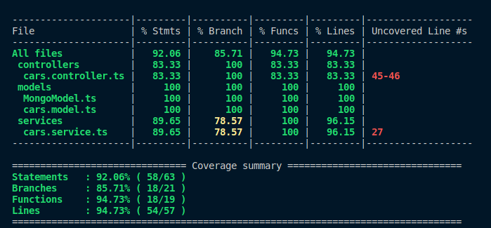

# MongoDB-commerce

## Introdução

O projeto consiste em construir uma API com CRUD para gerenciar uma concessionária de veículos utilizando Node.Js com MongoDB e aplicando os princípios da Programação Orientada a Objetos(POO)

## Sumário

- [Introdução](#introdução)
- [Ferramentas utilizadas](#ferramentas-utilizada)
- [CRUD](#crud)
- [MongoDB](#mongodb)
- [Mongoose](#mongoose)
- [POO](#poo)
- [SOLID](#solid)
- [Aprendizados](#aprendizados)
- [Testes unitários e tratamento de erros](#testes-unitários-e-tratamento-de-erros)
- [Instruções para utilizar a aplicação](#instruções-para-utilizar-a-aplicação)
- [Histórico de Commits](#histórico-de-commits)

## Ferramentas utilizada

**Back End:** Docker, MongoDB, NodeJS, Mongoose, Testes Unitários com Mocha.

## CRUD

CRUD é um acrônimo para Create, Read, Update and Delete. Em português Criar, Ler, Atualizar e Deletar registros, nesse projeto não trabalhamos direto com um banco de dados para fazer as operações, fiz as operações por meio dos endpoints e utilizei mongoose para fazer a comunicação com o banco de dados!

## MongoDB

Segundo o [Site oficial do MongoDB](https://www.mongodb.com/pt-br/what-is-mongodb), o MongoDB é um banco de dados de documentos com a escalabilidade e flexibilidade que você deseja junto com a consulta e indexação que você precisa.

## Mongoose

Segundo [esse artigo do freecodecamp](https://www.freecodecamp.org/portuguese/news/introducao-ao-mongoose-para-mongodb/), o Mongoose é um biblioteca de Modelagem de Dados de Objeto (ou ODM, do inglês: Object Data Modeling) para MongoDB e Node.js.

## POO

POO, programação orientada a objetos, é um dos paradigmas da programação. Sendo o objeto a junção de diversos comportamentos e estados, esse conceito está suportado na ideia de classes, que nada mais é que um conjunto de objetos que tem características comuns. A classe define o comportamento do objeto e esse, por sua vez, é definido por métodos e atributos. Nesse projeto foi possível praticar POO e consolidar os conhecimentos nos seus quatro pilares: herança, polimorfismo, abstração e encapsulamento.

## SOLID

SOLID ou S.O.L.I.D é um acrônimo para 5 princípios diferentes, cada princípio foi utilizado nesse projeto e ajudou a criar um código mais limpo e organizado, podendo o código ser reaproveitado por estar componetizado e de fácil refatoração. Cada letra do SOLID tem o seguinte significado: 
- S — Single Responsiblity Principle (Princípio da responsabilidade única)
- O — Open-Closed Principle (Princípio Aberto-Fechado)
- L — Liskov Substitution Principle (Princípio da substituição de Liskov)
- I — Interface Segregation Principle (Princípio da Segregação da Interface)
- D — Dependency Inversion Principle (Princípio da inversão da dependência)

## Aprendizados

Fui capaz de consolidar os conhecimentos em MongoDB, SOLID, POO e Node. Consegui criar uma API completa usando os pilares do POO, fazendo a abstração de todas as classes, definindo comportamentos claros para cada um dos métodos criado de acordo com o pilar do encapsulamento. Também foi possível fazer com que novas classes herdassem os comportamentos de outras e pudessem alterar esses comportamentos de acordo com o polimorfismo.

Aprendi a manipular o MongoDB com mongoose, uma ODM poderosíssima capaz de fazer requisições ao banco de dados, também exercitei a criação e utilização de interfaces, classes, instâncias e objetos, aplicando, mais uma vez, os pilares da POO.

## Testes unitários e tratamento de erros

Além de utilizar o mocha, chai e sinnon, também utilizei a biblioteca zod para fazer validações dos dados na camada de serviços, dessa forma eu garanto que qualquer dado que é recebido pela camada de controller será tratado na camada de serviços e, em caso de algum dado ou tipo inválido, o erro será lançado ali mesmo, sem precisar chamar a camada de models.

Também foi importante a utilização da biblioteca NYC para garantir a cobertura de testes em todo o arquivo, dessa forma, podemos manter um comportamento padrão de nossa aplicação e em caso de alguma alteração de código na nossa API os testes unitários irão dizer se tudo ainda funciona.

Atual Cobertura de Testes da Aplicação conferida linha a linha

## Instruções para utilizar a aplicação

Para utilizar a aplicação você precisará ter o [Docker](https://docs.docker.com/engine/install/ubuntu/) instalado.

Após clonar o repositório, você precisará usar o comando `docker-compose up -d` para criar e iniciar o container e depois executar o terminal bash do container e instalar as dependências do projeto com o comando `npm install` . O comando deverá ser feito via terminal no diretório em que está o arquivo **docker-compose.yml**.

Após o container subir você poderá fazer as requisições utilizando um cliente HTTP (insomnia, postman, httpie e etc);

## Histórico de commits

Você pode verificar todo o histório de commits para saber como a aplicação foi desenvolvida passo a passo, todos eles foram feitos com base no guia de [Conventional Commits](https://www.conventionalcommits.org/en/v1.0.0/), mantendo uma organização e descrição objetiva do que foi feito a cada mudança!
***
  

